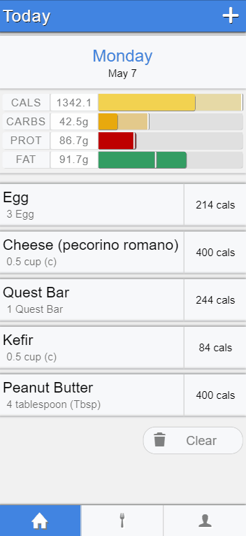
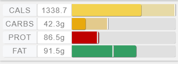
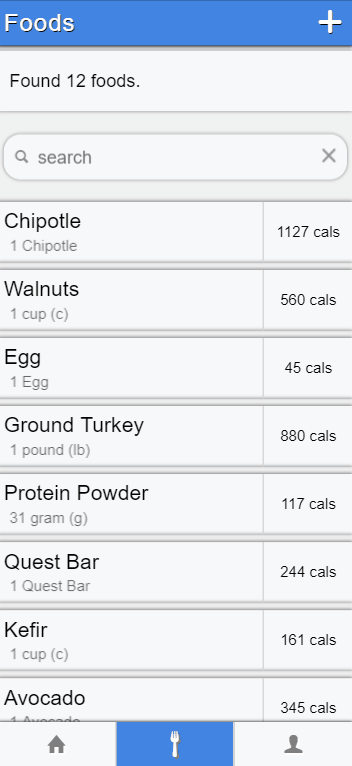
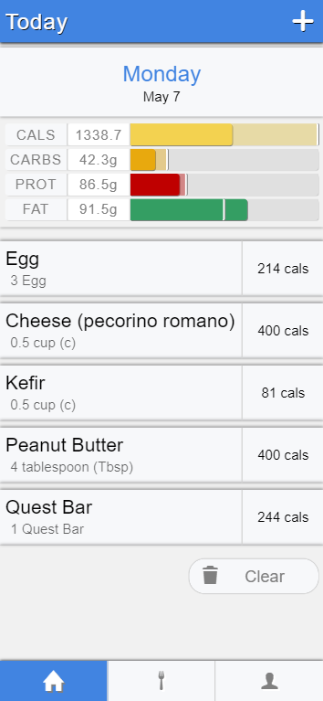
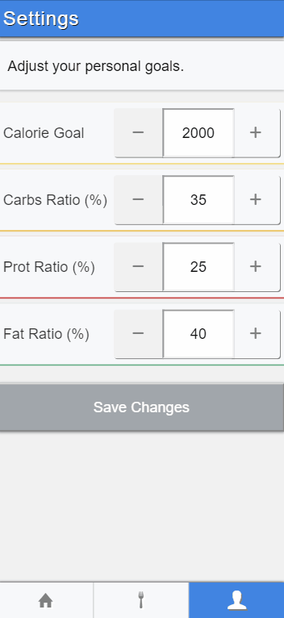

# [Macrotrac](http://macrotrac.herokuapp.com/)
> A nutrition tracker to help you meet your daily macronutrient ratio goals.

live: http://macrotrac.herokuapp.com/

## A Nutrition Tracker Focused on Macronutrients

Calorie-counting is a great first step towards nutritional fitness, but more and more people are becoming conscious of not just *how much* they eat, but *what* they eat.

By changing up the composition of the foods you eat, [you can make changes to your own body composition, health, and longevity](https://www.ncbi.nlm.nih.gov/pmc/articles/PMC4490104/).

**Macrotrac** doesn't try to tell you which macronutrient ratios to strive for; it's just here to help you achieve them!

## Macronutrient Visualization

All food items and daily totals are visualized by the macronutrient graph:
- a display of calories as a fraction of your daily limit and
- the macronutrients as a ratio of their calorie contribution to the sum total calories

(The screenshot above displays a user with a calorie goal of 2000cals and a 35%/25%/40% carbohydrate/protein/fat macronutrient ratio goal.)

As you adjust your own goals in **Macrotrac**, you'll see the macronutrient graph change to reflect your new goals!

### Your Foods  
Keep a list of foods you commonly eat in the app.

### Track Your Meals
Observe how the meals you eat affect your progress towards your goals.

### Set Goals
Personalize the app to reflect all food nutritional profiles in relation to the goals you set!

## Built with React, Managed by Redux

This app was built from my own [React-Redux starter template](https://github.com/devonbahary/react-redux-starter-template) and is the production iteration of a [prototype](https://github.com/devonbahary/macrotrac-redux-proto) I built previously.

In the [prototype](https://github.com/devonbahary/macrotrac-redux-proto) documentation I go into detail about how implementing Redux changed the development of my app and unburdened my components from the state and prop-passing tangled mess they would otherwise suffer from.
